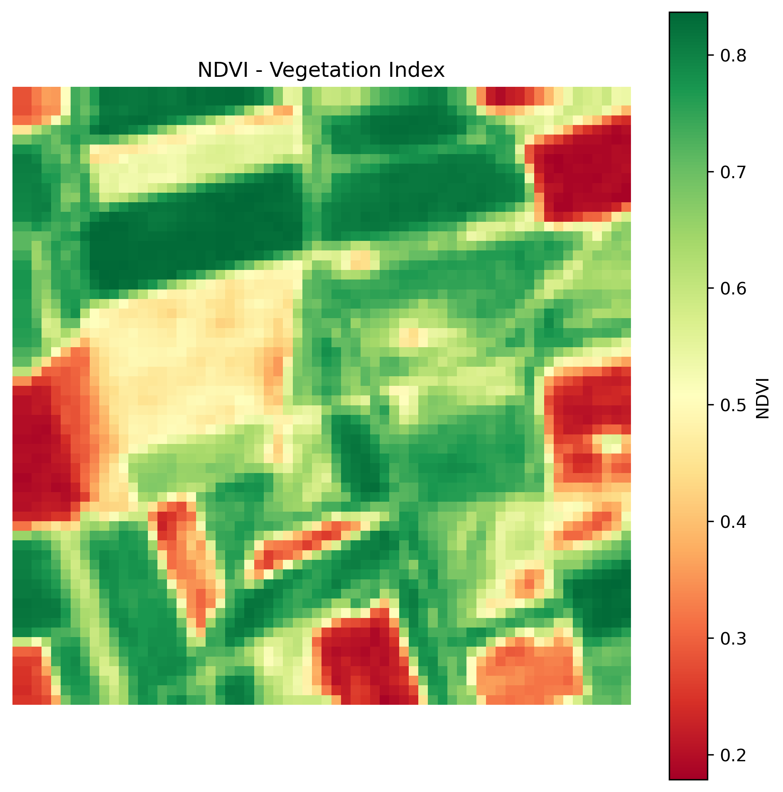
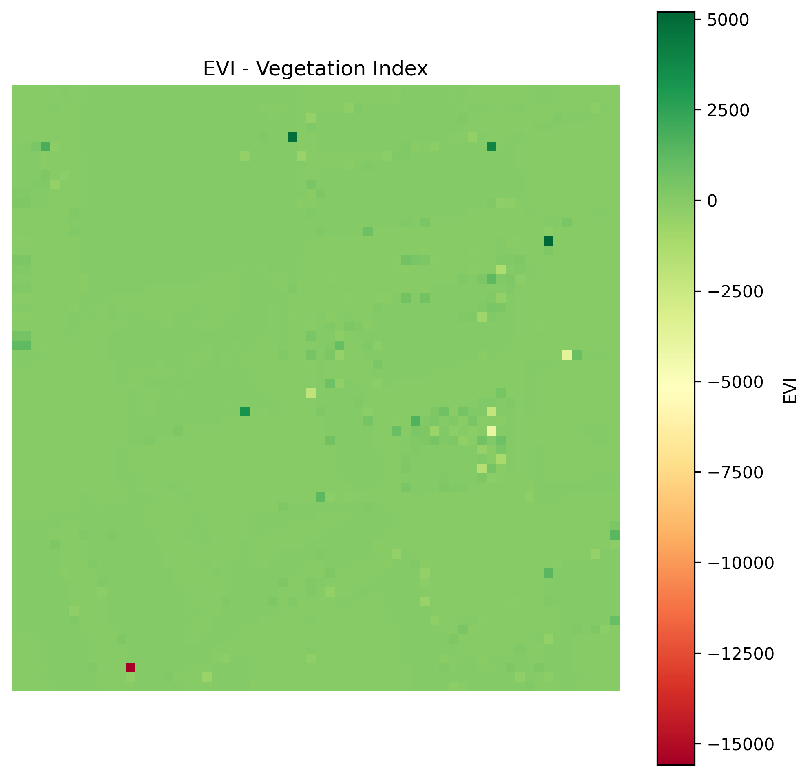

# Vegetation Indices Plotter

This module calculates and visualizes multiple vegetation indices from Sentinel-2 raster data. It supports a variety of indices commonly used for vegetation monitoring and analysis in agriculture, forestry, and environmental research.

## Features

- **Supported Vegetation Indices**:
  - **NDVI**: Normalized Difference Vegetation Index
  - **EVI**: Enhanced Vegetation Index
  - **SAVI**: Soil Adjusted Vegetation Index
  - **GNDVI**: Green Normalized Difference Vegetation Index
  - **MSAVI**: Modified Soil Adjusted Vegetation Index
- **Visualization**:
  - Generates color-coded plots for each index.
  - Saves plots as PNG files in the `../outputs/` directory.

## File Structure

```plaintext
vegetation_indices/
├── src/
│   └── vegetation_indices_plotter.py  # Script to calculate and plot indices
├── data/
│   └── sample_data.tif                # Example input raster file
├── outputs/
│   └── [Generated plots]              # Output PNG files
├── .gitignore                         # Files and directories to ignore
├── README.md                          # Project documentation
├── requirements.txt                   # Python dependencies
└── LICENSE                            # License file
```

## Usage
Prepare Input Data:

 - Place your GeoTIFF raster file in the ```data/``` directory.
 - Update the file_path variable in the script if using a different file.

Run the Script:
```bash
python src/vegetation_indices_plotter.py
```
## View Output:
 - Generated vegetation index plots will be saved in the outputs/ directory.
Each file will be named as {INDEX_NAME}_plot.png.

## Example Output





## Vegetation Indices
1. NDVI (Normalized Difference Vegetation Index)
Formula:
df'
$$NDVI= \frac{(NIR−Red)}{(NIR+Red)​}$$
 
2. EVI (Enhanced Vegetation Index)
Formula:

$$ EVI=2.5\times\frac{(NIR−Red)}{(NIR+6⋅Red−7.5⋅Blue+1)}$$

​
 
3. SAVI (Soil Adjusted Vegetation Index)
Formula:

$$ SAVI= \frac{(NIR−Red)}{(NIR+Red+L)}\dot (1+L) $$

Where $L=0.5$ (default value).

4. GNDVI (Green Normalized Difference Vegetation Index)
Formula:

 $$ GNDVI= \frac{(NIR−Green)}{(NIR+Green)} $$
 
5. MSAVI (Modified Soil Adjusted Vegetation Index)
Formula:

 $$ MSAVI=0.5\dot [ 2\dot NIR+1−  \sqrt{(2⋅NIR+1)^2 −8\dot(NIR−Red)} ] $$

​
 
Notes
Input raster data must include the following bands:
 - Band 2 (Blue)
 - Band 3 (Green)
 - Band 4 (Red)
 - Band 8 (Near-Infrared, NIR)

License
This project is licensed under the MIT License. See the LICENSE file for details.

References
 - Sentinel-2 Data Overview
 - Vegetation Indices Guide
 - rasterio Documentation
